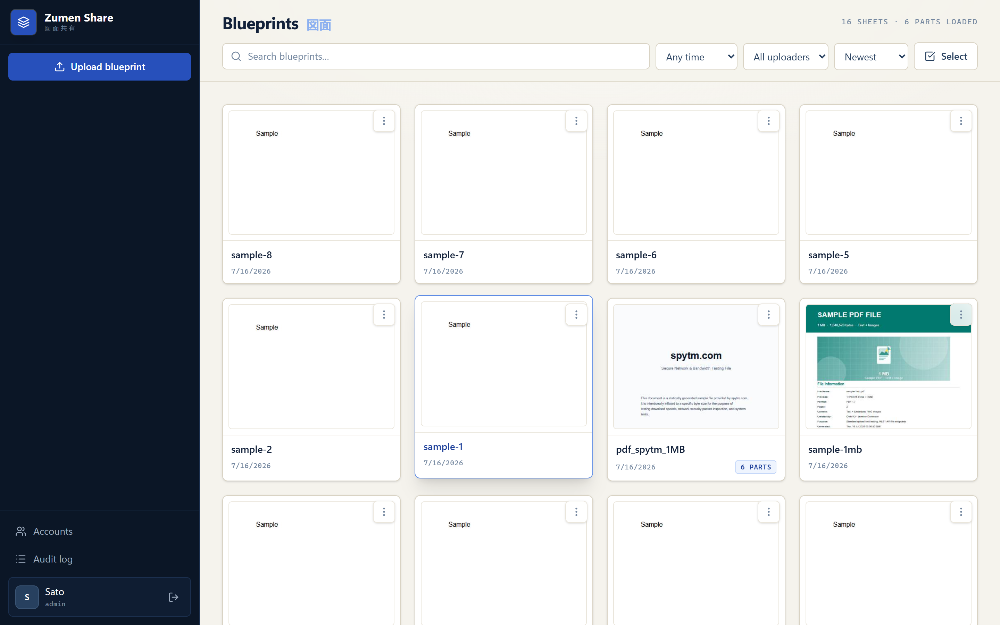
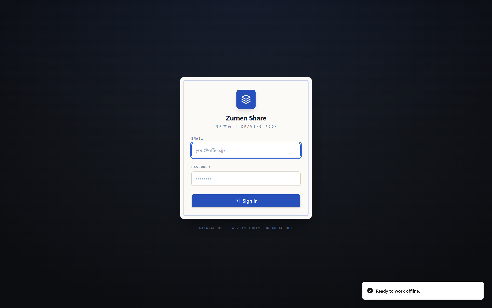
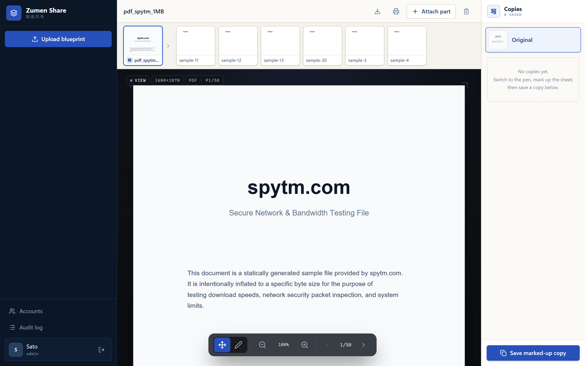
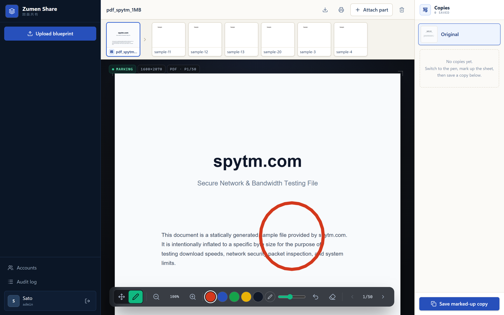

# Zumen Share

In-office zumen (blueprint) sharing. Upload images/PDFs (bulk OK), draw on them,
save marked-up versions.

Three record kinds, all in the `zumen` collection, distinguished by two relations:

- **oya (親)** — a top-level blueprint. `oya` and `source` both empty.
- **ko (子)** — a real part / detail drawing that belongs to a blueprint.
  `oya` = the blueprint's id. Shown strung under their oya in the left sidebar so
  small parts are easy to find; search matches oya and ko.
- **copy** — a flattened markup snapshot of one drawing (not a real part).
  `source` = the drawing it snapshots. Listed in the viewer's right sidebar.

Deleting a drawing cascades to its ko and its copies. Every upload / copy /
edit / delete is audit-logged with the user who did it.

Stack: PocketBase (auth, storage, API) + React/Vite/Tailwind frontend served
from `pb_public`.

## Screenshots

|  |  |
| :--: | :--: |
| **Blueprint library** — search, filter, bulk select, drag-and-drop upload<br>[](docs/screenshots/02-home.png) | **Sign in** — internal accounts, installable as a PWA<br>[](docs/screenshots/01-login.png) |
| **Viewer** — a blueprint (親) with its parts strung along the filmstrip<br>[](docs/screenshots/03-viewer.png) | **Markup** — pen tools with the viridian "live" accent; save as a copy<br>[](docs/screenshots/04-viewer-markup.png) |

## Run

```powershell
./pocketbase.exe serve --http=0.0.0.0:8090
```

- App: http://localhost:8090 (coworkers use `http://<your-ip>:8090` — allow it
  through Windows Firewall the first time)
- Admin UI: http://localhost:8090/_/ (superuser account)

For standing this up as an always-on office server (Windows service, HTTPS,
backups, updates), see [docs/DEPLOY.md](docs/DEPLOY.md).

## Accounts

Self-signup is disabled. Create app accounts as superuser in the Admin UI →
`users` collection → New record. Superuser and app accounts are separate.

## Audit logs

`audit_logs` collection (also the "Logs" button in the app). Plain-text rows
(no relations) so they survive user/zumen deletion. Written server-side by
`pb_hooks/`; not writable through the API.

## Storage: local ⇄ Cloudflare R2

Files live in `pb_data/storage` by default. To switch to an R2 bucket
(PocketBase built-in, no code):

1. Admin UI → **Settings → Files storage** → enable **S3 storage**
2. Endpoint: `https://<ACCOUNT_ID>.r2.cloudflarestorage.com`, region: `auto`,
   plus bucket name and an R2 API token's access key / secret
3. Save. New uploads go to the bucket. **Existing files are not migrated
   automatically** — copy the contents of `pb_data/storage` into the bucket
   first if you switch with data present.

## Development

```powershell
npm run dev    # vite on :5173, proxies /api to :8090 (pocketbase must be running)
npm run build  # outputs to pb_public, served by pocketbase
```

Schema changes go in `pb_migrations/` (applied automatically at startup, or
`./pocketbase.exe migrate up`).

## Install as an app (PWA)

The build ships a web-app manifest and a service worker (via `vite-plugin-pwa`),
so Zumen Share can be installed to a desktop/home screen and launches in its own
standalone window. The service worker precaches the app shell (HTML/JS/CSS +
icons + the PDF worker), so the shell loads instantly and survives brief network
drops. A new deploy shows a "Reload" toast rather than swapping assets mid-markup.

The API (`/api`) and admin UI (`/_/`) are never cached — records are live and
files use rotating auth tokens.

> **Requires a secure context.** Browsers only register service workers over
> **HTTPS** or on **`localhost`**. Coworkers reaching the app at
> `http://<your-ip>:8090` get the site but **not** installability/offline until
> it's served over HTTPS (e.g. a reverse proxy with a cert, Cloudflare Tunnel, or
> Tailscale). Everything degrades gracefully — plain HTTP just skips the SW.

App icons are generated from the in-app brand mark; re-run after changing it
(needs Chrome or Edge — no native image deps):

```powershell
node scripts/generate-pwa-icons.mjs
```

## Smoke test

```powershell
./smoke-test.ps1 -Email you@example.com -Password yourpass
```

Uploads a test file, saves a copy, edits, cascade-deletes, and verifies each
action landed in the audit log.
